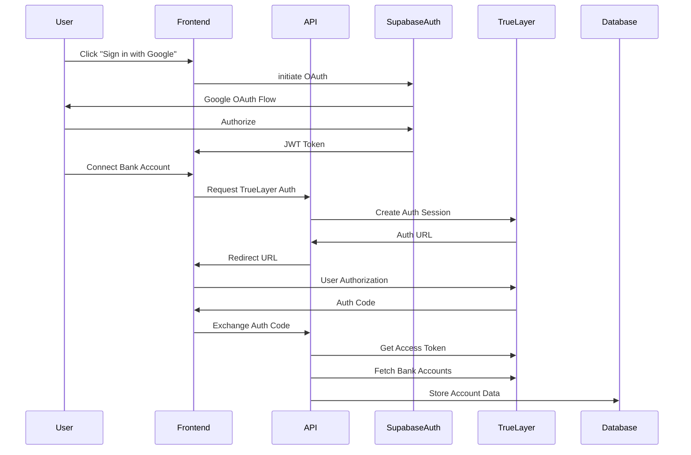
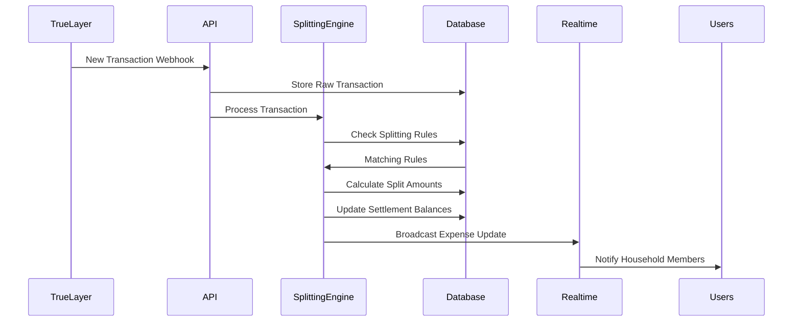
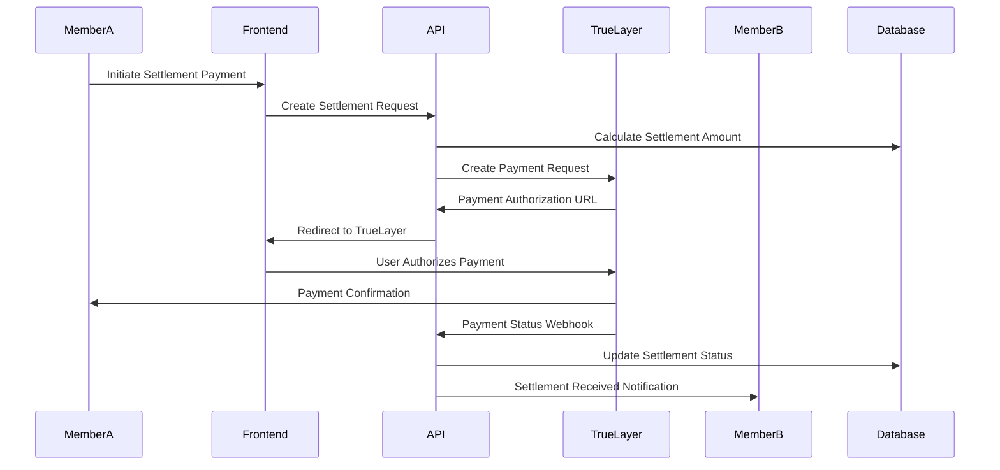

# Core Workflows

Here are the key system workflows:

## User Onboarding & Account Connection

```mermaid
sequenceDiagram
    participant User
    participant Frontend
    participant API
    participant SupabaseAuth
    participant TrueLayer
    participant Database

    User->>Frontend: Click "Sign in with Google"
    Frontend->>SupabaseAuth: initiate OAuth
    SupabaseAuth->>User: Google OAuth Flow
    User->>SupabaseAuth: Authorize
    SupabaseAuth->>Frontend: JWT Token

    User->>Frontend: Connect Bank Account
    Frontend->>API: Request TrueLayer Auth
    API->>TrueLayer: Create Auth Session
    TrueLayer->>API: Auth URL
    API->>Frontend: Redirect URL
    Frontend->>TrueLayer: User Authorization
    TrueLayer->>Frontend: Auth Code
    Frontend->>API: Exchange Auth Code
    API->>TrueLayer: Get Access Token
    API->>TrueLayer: Fetch Bank Accounts
    API->>Database: Store Account Data
```

## Automated Expense Splitting & Settlement

```mermaid
sequenceDiagram
    participant TrueLayer
    participant API
    participant SplittingEngine
    participant Database
    participant Realtime
    participant Users

    TrueLayer->>API: New Transaction Webhook
    API->>Database: Store Raw Transaction
    API->>SplittingEngine: Process Transaction

    SplittingEngine->>Database: Check Splitting Rules
    Database->>SplittingEngine: Matching Rules
    SplittingEngine->>Database: Calculate Split Amounts
    SplittingEngine->>Database: Update Settlement Balances

    SplittingEngine->>Realtime: Broadcast Expense Update
    Realtime->>Users: Notify Household Members
```

## Household Settlement with TrueLayer Payments

```mermaid
sequenceDiagram
    participant MemberA
    participant Frontend
    participant API
    participant TrueLayer
    participant MemberB
    participant Database

    MemberA->>Frontend: Initiate Settlement Payment
    Frontend->>API: Create Settlement Request
    API->>Database: Calculate Settlement Amount
    API->>TrueLayer: Create Payment Request
    TrueLayer->>API: Payment Authorization URL
    API->>Frontend: Redirect to TrueLayer
    Frontend->>TrueLayer: User Authorizes Payment
    TrueLayer->>MemberA: Payment Confirmation
    TrueLayer->>API: Payment Status Webhook
    API->>Database: Update Settlement Status
    API->>MemberB: Settlement Received Notification
```
