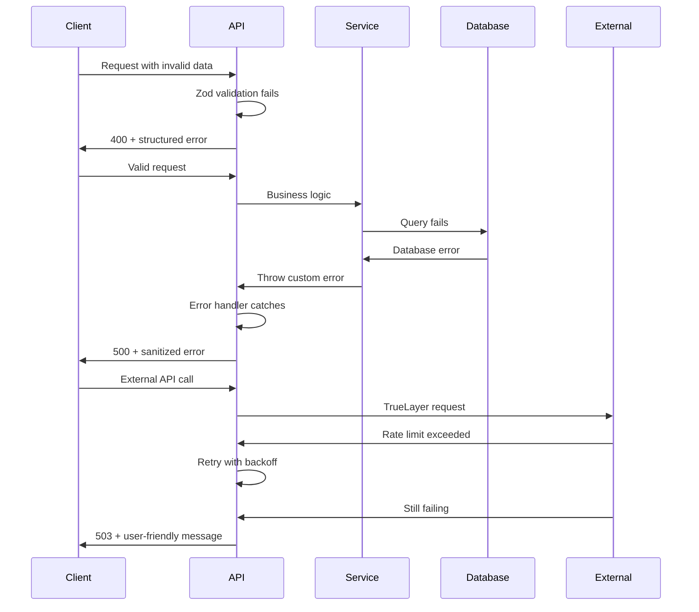

# Error Handling Strategy

## Error Flow



## Error Response Format

```typescript
interface ApiError {
  error: {
    code: string;
    message: string;
    details?: Record<string, any>;
    timestamp: string;
    requestId: string;
    retryable?: boolean;
  };
}
```

## Frontend Error Handling

```typescript
// Global error boundary component
export class ErrorBoundary extends Component<ErrorBoundaryProps, ErrorBoundaryState> {
  constructor(props: ErrorBoundaryProps) {
    super(props);
    this.state = { hasError: false };
  }

  static getDerivedStateFromError(error: Error): ErrorBoundaryState {
    return { hasError: true, error };
  }

  componentDidCatch(error: Error, errorInfo: any) {
    console.error('Error caught by boundary:', error, errorInfo);

    // Report to monitoring service
    if (process.env.NODE_ENV === 'production') {
      this.reportError(error, errorInfo);
    }
  }

  render() {
    if (this.state.hasError) {
      return (
        <Card className="max-w-md mx-auto mt-8">
          <CardHeader>
            <CardTitle>Something went wrong</CardTitle>
          </CardHeader>
          <CardContent>
            <p className="text-gray-600 mb-4">
              We encountered an unexpected error. Please try refreshing the page.
            </p>
            <Button onClick={() => window.location.reload()}>
              Refresh Page
            </Button>
          </CardContent>
        </Card>
      );
    }

    return this.props.children;
  }
}
```

## Backend Error Handling

```typescript
// Standard error handler for API routes
export class AppError extends Error {
  constructor(
    message: string,
    public statusCode: number = 500,
    public code: string = 'INTERNAL_ERROR',
    public isOperational: boolean = true,
    public details?: Record<string, any>
  ) {
    super(message);
    this.name = 'AppError';
  }
}

// Global error handler utility
export function handleApiError(error: unknown, requestId: string): NextResponse {
  const timestamp = new Date().toISOString();

  // Log error for debugging
  console.error(`[${requestId}] API Error:`, error);

  if (error instanceof AppError) {
    return NextResponse.json(
      {
        error: {
          code: error.code,
          message: error.message,
          details: error.details,
          timestamp,
          requestId,
          retryable: error.statusCode >= 500,
        },
      },
      { status: error.statusCode }
    );
  }

  // Unknown error - don't expose internal details
  return NextResponse.json(
    {
      error: {
        code: 'INTERNAL_ERROR',
        message: 'An unexpected error occurred. Please try again later.',
        timestamp,
        requestId,
        retryable: true,
      },
    },
    { status: 500 }
  );
}
```
