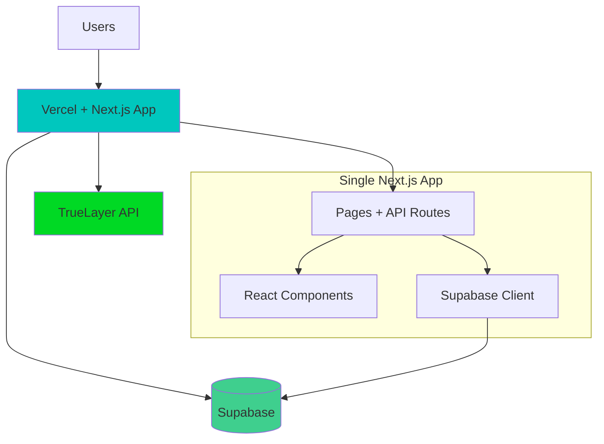

# High Level Architecture

## Technical Summary

MyFinancePal employs a **modern monorepo fullstack architecture** with Next.js React frontend and Node.js Express backend, deployed on **Vercel + Supabase** for rapid development and built-in compliance features. The system integrates **TrueLayer APIs** for financial data aggregation while maintaining strict **privacy-first data isolation** between individual and household views. The architecture supports **real-time expense splitting** through event-driven settlement calculations and leverages **PostgreSQL with Redis caching** for transactional integrity and performance. This design achieves the PRD's core goals of automated expense sharing, comprehensive net worth tracking, and regulatory compliance while maintaining scalability for 10,000+ UK households.

## Platform and Infrastructure Choice

**Platform:** Vercel (hosting) + Supabase (database/auth)
**Key Services:** Next.js 14 (full-stack), Supabase (all backend needs), TrueLayer (financial data)
**Deployment Host and Regions:** Vercel Edge Network with EU-West (London) for data residency

**Rationale:** Vercel + Supabase balances speed-to-market with financial-grade security. Supabase's built-in RLS eliminates custom privacy logic development. This stack maximizes AI agent success through well-documented, mainstream technologies.

## Repository Structure

**Structure:** Single Next.js App (not even a monorepo initially)
**Monorepo Tool:** None for V1 - Keep it simple
**Package Organization:** Standard Next.js structure with clear folders

## High Level Architecture Diagram

## Architectural Patterns

- **Next.js Full-Stack:** Frontend + API routes in one app - _Rationale:_ AI agents excel at this pattern, zero deployment complexity
- **Supabase Direct Client:** Database access through official client - _Rationale:_ Well-documented patterns, built-in security
- **File-Based Routing:** Next.js conventions - _Rationale:_ Zero configuration, AI agents know these patterns perfectly
- **Component Co-location:** Components near pages that use them - _Rationale:_ Easier for AI agents to understand relationships
- **Progressive Enhancement:** Start simple, add complexity later - _Rationale:_ V1 focus on core functionality only
